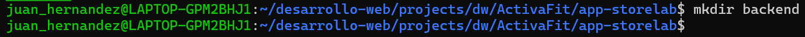

# **Manual de creación del Backend — NestJS + Sequelize (Clean Architecture)**

#### **1.1 — Crear carpetas padre y permisos**

```         
mkdir -p /home/portatiljq/apps/dlloweb/nestjs/express_sequelize chmod -R 755 /home/portatiljq/apps/dlloweb/nestjs/express_sequelize
```


